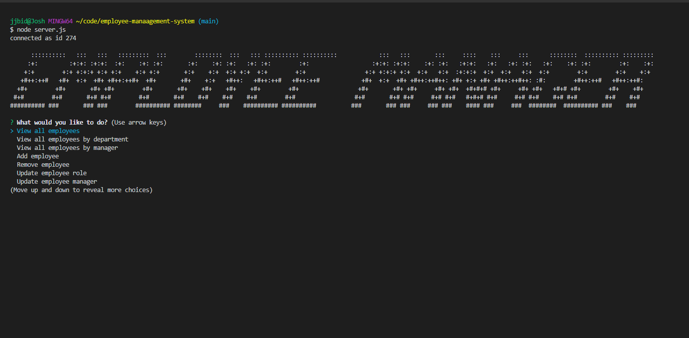
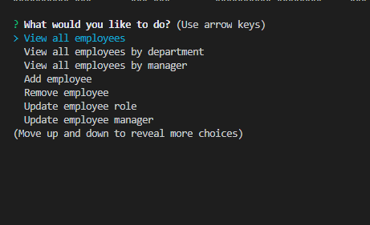
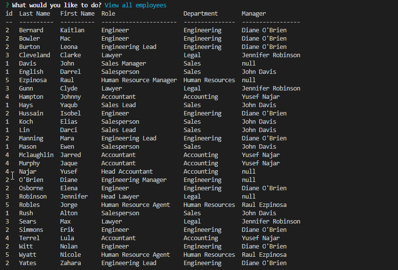

# Employee Management System

## Description 

This is a command line-driven app that allows a user to view, add, and edit employees in the connected database. The app uses Node.JS to run and mySQL to manage the database. The dependencies I installed were inquirer to gather information from the user, mysql to interact with the database, console.table to display the data in a readable way, and ascii-themes to make an ascii heading.

With This app a user can do the following: 
* View all employees
* View employees by department
* View employees by manager
* Add employees
* Remove employees
* Change an employee's role
* Change an employee's manager

I have included in the file structure the following:  
* A department list md file  
* CSV files I made for both employees and roles  
* The schema for the database  
* A seed file for the departments

## Links

GitHub repository: https://github.com/jjbidwell/employee-manaagement-system  
Video demo: https://drive.google.com/file/d/1nIo20B_5CUC0si1nk5J8P5FcUkU53tgB/view

## Screenshots 

